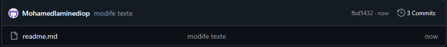

Tutoriel : Initialisation et gestion d'un dépôt Git
Ce document décrit les étapes pour initialiser un dépôt Git, configurer les informations utilisateur, ajouter des fichiers, effectuer des commits et pousser les modifications vers un dépôt distant sur GitHub.
Prérequis
    • Avoir installé Git sur votre machine. 
    • Posséder un compte GitHub. 
    • Avoir configuré une méthode d'authentification moderne (clé SSH ou token personnel). 
Étapes
1. Création et initialisation du dépôt
cd /mnt/c/depot_git
git clone https://github.com/Mohamedlaminediop/tuto_git_cpgeom_md.git
cd tuto_git_cpgeom_md
````git init````
Cela crée un dépôt Git vide dans le répertoire tuto_git_cpgeom_md.
2. Configuration des informations utilisateur
``git config --global user.name "Mohamedlaminediop"``
``git config --global user.email "momodiop070@gmail.com"``
Ces commandes définissent votre identité pour tous les commits.
3. Ajout d'un fichier et premier commit
echo "# Tuto Git CPGeom" > README.md
``git add README.md``
``git commit -m "Premier commit"``
Cela ajoute README.md au suivi de Git et crée un premier commit.
4. Renommage de la branche principale
``git branch -M main``
Cela renomme la branche master en main (pratique courante aujourd'hui).
5. Ajout du dépôt distant
``git remote add origin https://github.com/Mohamedlaminediop/tuto_git_cpgeom_md.git``
Cela associe le dépôt local à un dépôt distant sur GitHub.
6. Pousser les modifications vers GitHub
``git push -u origin main``
⚠️ Utiliser une méthode d'authentification sécurisée
Depuis août 2021, GitHub ne permet plus l'authentification avec un mot de passe. Il faut utiliser une clé SSH ou un token personnel.
Solution :
    • Générer un token personnel sur GitHub Developer Settings 
    • Utiliser ce token lors de l'authentification au lieu d'un mot de passe. 
7. Vérification du statut des modifications
``git status``
Affiche les fichiers modifiés ou ajoutés depuis le dernier commit.
8. Ajout et commit des modifications
``git add * `` .
``git commit -m "Mise à jour du fichier README"``
Ajoute toutes les modifications en préparation pour un commit.
9. Pousser les modifications vers GitHub
``git push``
Envoie les modifications locales vers le dépôt distant.
Notes supplémentaires
    • Utiliser SSH pour éviter les demandes répétées d'identification 
    • Créer des branches pour tester de nouvelles fonctionnalités avant de les fusionner dans main 
Conclusion
Ce tutoriel décrit les étapes de base pour configurer et utiliser Git avec GitHub. Vous pouvez maintenant gérer vos projets avec un suivi efficace des versions ! 🎉

Mon image

